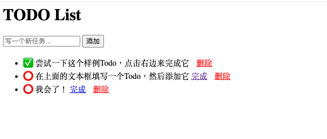

# README



这是一个简单的基于go语言gin框架的TODO待办事项Web应用，使用mysql数据库。

## 功能

- ✅ 添加任务
- ✅ 标记完成
- ✅ 删除任务
- ✅ 数据持久化（MySQL）

## 技术栈

- Go 1.26.3
- Gin Web Framework
- MySQL 9.3.0
- Redis

## 前置条件

- 安装 MySQL 和 Redis 并启动服务
- MySQL（后台运行）：`brew services start mysql`
- Redis（前台运行，需保持终端窗口打开）：`redis-stack-server`
- 确保你有数据库的 `root` 权限，或已创建相应的数据库用户

## 配置环境变量
```bash
export DBUSER=root
export DBPASS=你的密码
```

## 初始化数据库

首次运行前，执行以下命令创建表：

```bash
mysql -u root -p < scripts/create-tables.sql
```
## 启动服务
```bash
go run .
```
docker compose up --build
打开浏览器访问 http://localhost:8080